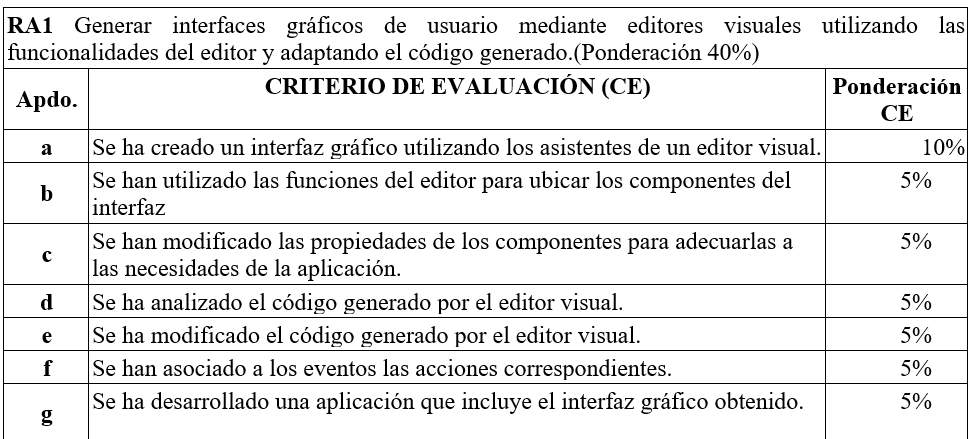
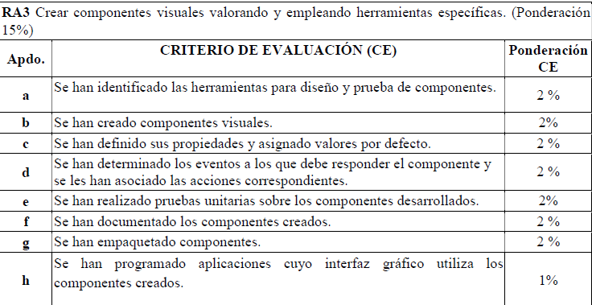
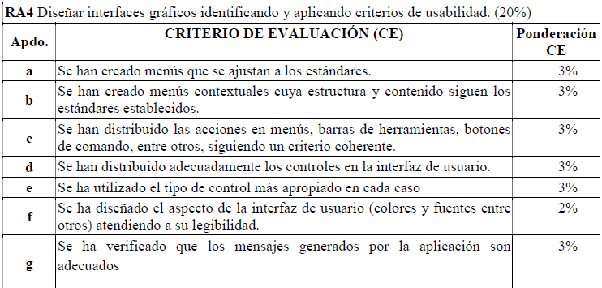

# 🐾 PAWs — Página Web de Acogidas

## 1. Introducción
**PAWs** es una página web creada con el propósito de facilitar la conexión entre casas de acogida y posibles adoptantes de animales.  
El proyecto busca ofrecer un espacio informativo donde los usuarios puedan conocer las diferentes casas de acogida disponibles, así como los animales que actualmente se encuentran en busca de un hogar.  

Además, el sitio incluye un pequeño homenaje personal a un conejo, y un formulario de satisfacción que permite a los visitantes dejar su opinión sobre la página.  
Este proyecto fue desarrollado como parte de una entrega académica, con el objetivo de aplicar conocimientos de diseño visual.

---

## 2. Objetivos

### Objetivo general
Crear una página web informativa y visualmente agradable que muestre información sobre casas de acogida y animales en adopción.

### Objetivos específicos
- Diseñar una estructura clara y fácil de navegar.  
- Permitir al visitante visualizar los locales de acogida y los animales disponibles.  
- Implementar un diseño visual limpio y minimalista.  
- Añadir un formulario para recoger la opinión de los visitantes.  

---

## 3. Tecnologías utilizadas

El desarrollo del proyecto se realizó utilizando las siguientes tecnologías:

- **HTML5:** para la estructura y contenido de la página.  
- **CSS:** para el diseño, formato y disposición de los elementos.  
- **JavaScript:** para añadir interactividad básica y dinamismo a la experiencia del usuario.  

Estas tecnologías permiten crear un sitio web estático, funcional y adaptable a diferentes dispositivos.

---

## 4. Estructura del sitio

El sitio **PAWs** está compuesto por varias páginas interconectadas:

- **Página principal:** contiene la presentación del proyecto y enlaces al resto de secciones.  
- **Casas de acogida:** muestra información sobre los locales de acogida y su ubicación.  
- **Animales disponibles:** lista de animales que se pueden adoptar, con su descripción e imágenes.  
- **Formulario de satisfacción:** permite a los usuarios dejar su opinión sobre la página.  
- **Homenaje:** una página dedicada al conejo de uno de los autores, como detalle personal dentro del proyecto.  

Cada página está enlazada mediante un menú de navegación sencillo que permite moverse fácilmente por el sitio.

---

## 5. Diseño visual

El diseño se caracteriza por su **estilo limpio y minimalista**, priorizando la claridad y la legibilidad.  
El **color blanco** fue elegido como base principal del sitio, ya que aporta una apariencia moderna, elegante y transmite sensación de pureza y tranquilidad.  

Se ha cuidado la disposición de los elementos para mantener una estructura ordenada y coherente en todas las páginas.  
El resultado es un sitio visualmente atractivo y fácil de usar.

---

## 6. Funcionamiento

El sitio **PAWs** no requiere registro de usuarios ni autenticación.  
Su funcionamiento se basa únicamente en la navegación a través de las distintas páginas, donde el visitante puede:

- Consultar información sobre las casas de acogida.  
- Ver los animales disponibles para adopción.  
- Leer el homenaje incluido.  
- Completar el formulario de satisfacción.  

El enfoque es totalmente informativo y orientado a la experiencia del usuario.

---

## 7. Problemas

Durante el desarrollo de la página web, ha habido algunos problemas debido a nuestra limitación de conocimiento como desarrolar un asistente virtual dentro de la propia página web para que proporcione consejos o información para poder tener el conocimiento suficiente para poder mantener a una mascota. También teníamos en mente agregar un buscador interno con IA para buscar tu mascota ideal.

---

## 8. Conclusiones

El desarrollo de **PAWs** ha permitido aplicar conocimientos fundamentales de diseño web y programación front-end.  
Durante el proceso se ha puesto especial atención en la organización del contenido, la estética visual y la facilidad de uso.  

Como posibles mejoras futuras, se podría incorporar un sistema de usuarios, una base de datos para gestionar las adopciones y una sección de contacto directo con las casas de acogida.  

**PAWs** demuestra que, con herramientas simples como HTML, CSS y JavaScript, es posible crear una web útil, personal y significativa.

---

## 9. Rúbrica

---

## 10. Resultados de aprendizaje

### RA1. 

- **A.** Utilizado en el prototipo y durante el desarrollo.
- **B.** Utilizado durante el prototipo para indicar a gusto del desarrollador como lo queremos exactamente y el uso de ChatGPT para generar código y pedirle el objetivo que queremos.
- **C.** Se han modificado el CSS para realizar este objetivo.
- **D.** Ya dicho previamente.
- **E.** Ya dicho previamente.
- **F.** Con javascript hemos conseguido este objetivo y con la navegación.
- **G.** Básicamente nuestra web.

### RA3.

- **A.** Se usó una extensión del visual para ver y probar en tiempo real los cambios.
- **B.** Se ha creado botones, contenedores e imágenes.
- **C.** El CSS creado que también puede ser reutilizado y algunas imágenes por defecto si no sale aparece un texto.
- **D.** Con Javascript hemos podido realizar este objetivo.

### RA4.

- **A.** Hay menú de navegación en todas las páginas de la web.
- **B.** Hemos creado menú que hemos modificado la ruta de las webs porque en función del lugar son rutas diferentes.
- **C.** Hay coherencias en los botones y las acciones de los botones.
- **D.** Buena distribucción de cada control.
- **E.** Control adecuado en cada caso por ejemplo en el formulario tenemos contenedores ya que se escribirá en ese sitio y no en otro lado.
- **F.** Legibilidad en los colores y fuentes. 
- **G.** La aplicación no genera mensajes, solo genera archivos en la página web del homenaje.

---
*Muchas gracias por leer*
